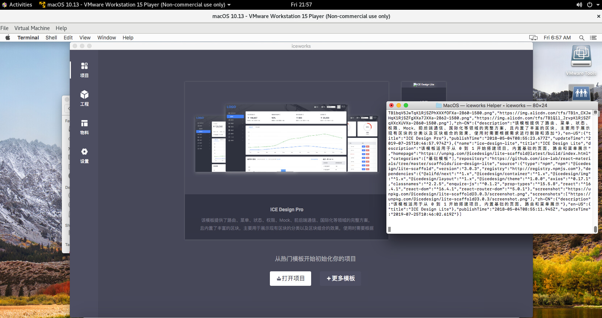

# Introduction

本文档介绍虚拟机的使用，有关更轻量的 docker 虚拟化参见 [docker.md](./docker.md)。

由于历史原因，
目前实验室部署有两类虚拟机系统, 一类是 vmware player, 由于安装的是免费版，限制较多，但图形化界面相对比较成熟；
另一类是 virtualbox，为开源系统，采用 `valgrant` 进行管理。

## VMWare
用 VMWare 虚拟机部署的虚拟机本着实用的原则，配置较高，一般处于关闭状态，仅在有需要时开机并且对外开放端口。
* 一台 Win 10，4核8GB内存，128GB SSD本机硬盘，已安装 VS2019 C#, Cygwin 开发环境
（CPU慢于非虚拟化桌面，而由于存储类型不一样，Win10 VMWare, Disk IO 快于linux 系统中 Home读写）
（公共账号用户名：lab2c，密码：guest，是Win10 普通用户）
这台机子同时有着连接校本部vpn使得正版matlab 可以在管理节点上使用的作用

Windows 支持ssh 连接和rdp 连接，下图是用 rdp连接 windows 的截图：

之前连接的效果图


Windows 10 虚拟机原来的网络配置是用 NAT 方法将远程桌面 3306 端口暴露给外网，后来由于要支持 matlab 的认证，改用 Bridge 方法加入 10.1.1.1/24 内网，虽然3306端口还开着，但原来配置的远程桌面不能使用了。目前可以用 VMWare （先登录 First Type 远程桌面）的方式连接。

### 连接Windows 远程桌面
在 windows  电脑 上首先 ssh 登陆管理节点，输入
```shell
ssh -L 10.8.4.170:3389:10.1.1.4:3389 username@10.8.4.170
```
打开远程桌面输入 10.8.4.170地址后连接即可。

* MacOS High Serria (10.13)（4核8GB内存，64GB SSD本机硬盘，暂无公共账号），已安装 command line tools, `Homebrew`

连接效果图


## VirtualBox

VirtualBox 使用 `valgrant`　进行配置，目前下载了 Ubuntu 14.04 和 MacOS 12 的虚拟机。

Available virtual machine can be found from [vagrantup](https://app.vagrantup.com).

默认是使用 ssh 登录。


