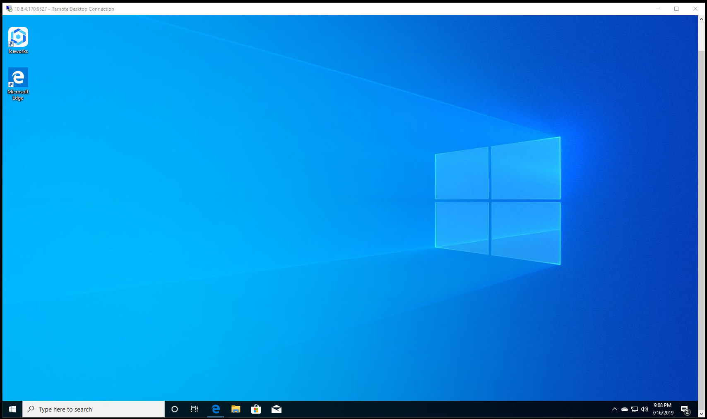

## Introduction

本文档介绍远程桌面的使用，目前支持10个连接同时在线，未来有可能有所增加。

目前实验室部署的远程桌面有3类, 一类是 centos 7 操作系统(Linux), 是非虚拟化的, 相对比较成熟；

第二类是 ubuntu 16.04 系统。

第三类是用 VMWare 虚拟机部署的，为节约资源，一般处于关闭状态，仅在有需要时开机并且对外开放端口。
* 一台 Win 10，4核8GB内存，128GB SSD本机硬盘
（CPU慢于非虚拟化桌面，而由于存储类型不一样，Win10 VMWare, Disk IO 快于linux 系统中 Home读写）
（公共账号用户名：lab2c，密码：guest，是Win10 普通用户）
* MacOS 13（4核8GB内存，64GB SSD本机硬盘，暂无公共账号）

## First Type

欲使用第一类远程桌面，首先在[官网](https://www.cendio.com/thinlinc/download) 下载相应操作系统的客户端（**专用**）。

连接时只需输入IP地址，无需输入端口号，用户名与密码与ssh 登录的用户名和密码相同。下图是 windows 客户端使用截图：


thinlinc 还支持用浏览器作为客户端登录(HTTPS)，使用 300端口。https://10.8.4.170:300。

# 注意
由于实验室很多同学在自己的`.bashrc` 文件中 load anaconda3 模块与系统 python 冲突，使用 vnc 会出现闪退的问题。建议在自己的HOME 目录下更改
`.bash_profile`文件中，将以下行：
```shell
if [ -f ~/.bashrc ]; then
```
改成：
```shell 
if [ -f ~/.bashrc ] && [ -z "$TLPREFIX" ]; then
```

thinlinc 是商业软件，实验室买的授权是10个用户同时在线。
## Second Type
仅限于使用 Thinlinc 客户端连接，支持最多5个用户同时在线，ip地址为 10.8.4.172，用户名与密码同 ssh 登陆用。


## Third Type (Experimental)

Windows 10 虚拟机原来的网络配置是用 NAT 方法将远程桌面 3306 端口暴露给外网，后来由于要支持 matlab 的认证，改用 Bridge 方法加入 10.1.1.1/24 内网，虽然3306端口还开着，但原来配置的远程桌面不能使用了。目前可以用 VNC 或 VMWare （先登录 First Type 远程桌面）的方式连接。

之前连接的效果图


### Third type (Experimental) -- MacOS High Serria
MacOS 的虚拟机是三大操作系统中最难配置的，其中一个难点是镜像不好找且不开源。鉴于个人学习研究用途并不是 illegal，服务器上VMWare 配置了一台 MacOS 的虚拟机。可以用 VNC 或 VMWare 连接。

连接效果图

