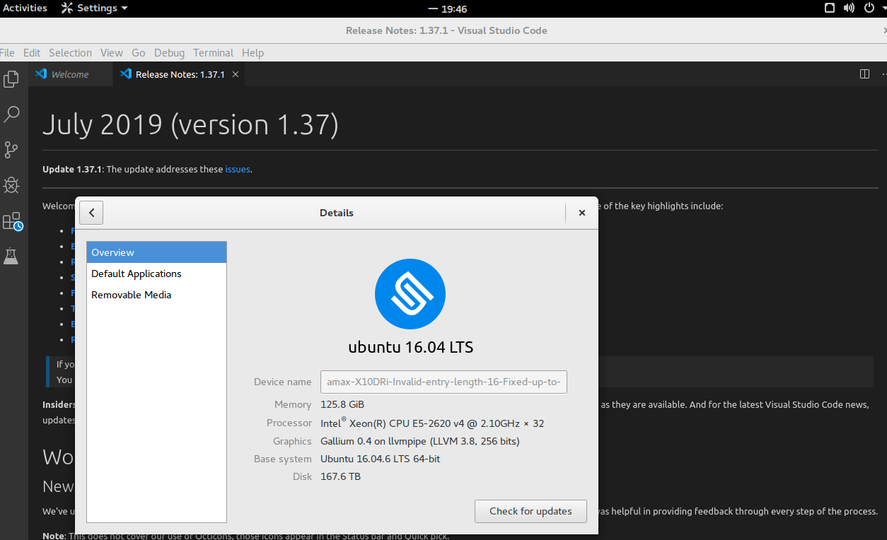

# Introduction

本文档介绍远程桌面的使用。

目前实验室分别在管理节点（10.8.4.170）和存储节点（10.8.4.172）部署了 thinlinc 远程桌面服务器。

The manage node supports 10 concurrent connections while the storage node supports 5 concurrent connections.

欲使用，首先在[官网](https://www.cendio.com/thinlinc/download) 下载相应操作系统的客户端（**专用**）。

连接时只需输入IP地址，无需输入端口号，用户名与密码与ssh 登录的用户名和密码相同。下图是 windows 客户端使用截图：


thinlinc 还支持用浏览器作为客户端登录(HTTPS)，使用 300端口。https://10.8.4.170:300。

首次登录后选择桌面环境，管理节点建议选择 xfce 桌面环境, 存储节点选 gnome 桌面环境。

桌面环境与服务器的操作系统一致，可以打开图形化的终端进行操作。


## 注意
由于实验室很多同学在自己的`.bashrc` 文件中 load anaconda3 模块与系统 python 冲突，使用 vnc 会出现闪退的问题。建议在自己的HOME 目录下更改
`.bash_profile`文件中，将以下行：
```shell
if [ -f ~/.bashrc ]; then
```
改成：
```shell 
if [ -f ~/.bashrc ] && [ -z "$TLPREFIX" ]; then
```

thinlinc 是商业软件，实验室买的授权是管理节点10个用户同时在线。
存储节点是安装的免费版, 支持最多5个用户同时在线。

下图是在存储节点打开 gnome 远程桌面的截图。



